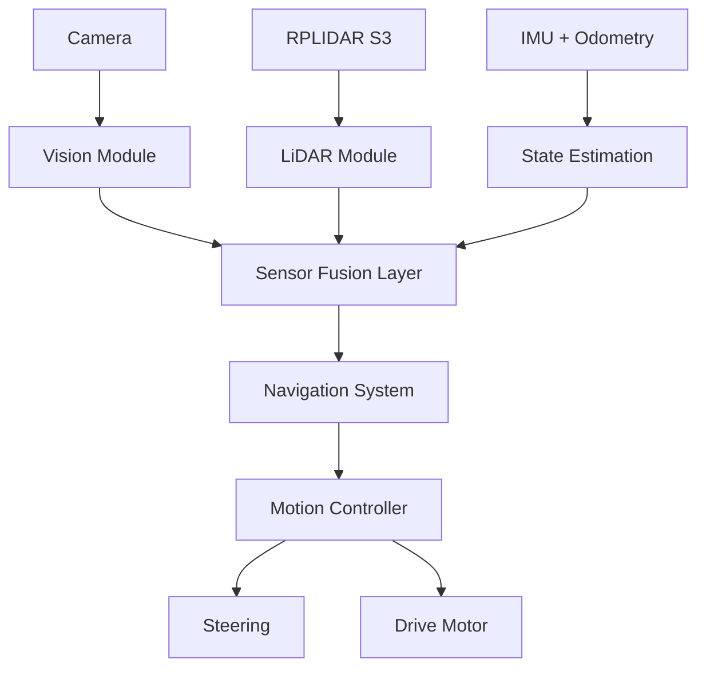

# **KMITL iLARP — WRO Future Engineers 2026**

> Autonomous mobile robot developed by **KMITL iLARP** for the
> **World Robot Olympiad 2026 — Future Engineers** category.

<p align="center">
  
</p>

---

## **Project Overview**

This project presents the design and implementation of an autonomous mobile robot for the **WRO Future Engineers 2026 competition**.

The system integrates:

* Computer Vision for object detection and classification
* LiDAR-based environment perception
* IMU and odometry for motion stability
* Sensor fusion for robust decision making
* Model-based motion control

The robot is designed to operate in structured track environments while maintaining robustness under dynamic obstacles and varying lighting conditions.

---

## **System Architecture**



### System Design Philosophy

The system is built on multi-sensor redundancy, where each sensor contributes a different perspective:

1. Camera → semantic understanding (what and where)
2. LiDAR → geometric understanding (distance and structure)
3. IMU + Odometry → motion consistency (stability and heading)

This separation ensures robustness even when one sensor is degraded.

---

## **Computer Vision System**

The vision system is implemented in C++ with OpenCV, using libcamera/LCCV for image acquisition.

### Processing Pipeline

```text
Frame Capture
   ↓
Color Space Conversion (BGR → HSV)
   ↓
Color Segmentation (Red / Green)
   ↓
Morphological Filtering
   ↓
Contour Extraction
   ↓
Geometric Validation
   ↓
Object Classification
   ↓
Bearing Estimation
```

### Output Features

* Object class (red / green obstacle)
* Bounding box
* Image-space position
* Relative bearing angle

Documentation: `docs/vision/README.md`
Source Code: `code/modules/camera`

---

## **LiDAR Perception System**

The robot uses RPLIDAR S3 for environmental geometry sensing.

### Processing Pipeline

```text
Raw Scan Data
   ↓
Point Filtering
   ↓
Polar → Cartesian Conversion
   ↓
Sector Segmentation
   ↓
Statistical Filtering (Median)
   ↓
Wall Estimation
```

### Output Features

* Front distance
* Left / Right distance
* Wall angle estimation
* Track boundary detection

Documentation: `docs/lidar/README.md`
Source Code: `code/modules/lidar`

---

## **IMU and Odometry System**

The motion estimation system combines:

* IMU angular velocity
* Wheel odometry
* Drift correction logic

### Responsibilities

* Heading stabilization
* Short-term pose estimation
* Motion smoothing for control layer

Documentation: `docs/odometry/README.md`

---

## **Navigation System**

The navigation system operates as a state-driven decision engine.

### Open Challenge Strategy

```text
LiDAR Geometry
   ↓
Wall Alignment
   ↓
Track Center Estimation
   ↓
Trajectory Generation
   ↓
Steering Control
```

### Obstacle Challenge Strategy

```text
Camera (Object Detection)
        ↓
LiDAR (Geometry Context)
        ↓
IMU + Odometry (Stability)
        ↓
Sensor Fusion Layer
        ↓
Navigation State Machine
        ↓
Path Decision
```

Documentation: `docs/navigation/README.md`

---

## **Motion Control System**

The motion controller converts navigation outputs into actuator commands.

### Components

* Steering control (servo-based)
* Drive motor control
* Speed regulation
* Stability correction loop

Documentation: `docs/control/README.md`

---

## **Software Architecture**

The system is implemented in C++17 and structured into modular components.

```text
code/
├── app/
├── modules/
│   ├── camera/
│   └── lidar/
├── external/
│   ├── LCCV/
│   └── rplidar_sdk/
├── utils/
├── Build_n_deploy.sh
├── CMakeLists.txt
├── Dockerfile.compile
└── Dockerfile.cross
```

### Core Technologies

| No | Technology  | Purpose                          |
| -- | ----------- | -------------------------------- |
| 1  | C++17       | Core system implementation       |
| 2  | OpenCV      | Vision processing                |
| 3  | libcamera   | Camera interface                 |
| 4  | LCCV        | Camera wrapper                   |
| 5  | RPLIDAR SDK | LiDAR interface                  |
| 6  | CMake       | Build system                     |
| 7  | Docker      | Cross-platform build environment |

---

## **Mechanical Design**

The mechanical system is designed in SolidWorks with focus on:

* Compact chassis design
* Stable weight distribution
* Efficient steering geometry
* Modular sensor mounting

### Components

1. Chassis structure
2. Steering mechanism
3. Differential drivetrain
4. Motor mounts
5. Sensor mounts (Camera + LiDAR)

CAD Files: `CAD/`
Documentation: `docs/mechanical/README.md`

---

## **Hardware System**

| No | Component      | Function                      |
| -- | -------------- | ----------------------------- |
| 1  | Raspberry Pi   | Main compute unit             |
| 2  | Camera         | Vision sensing                |
| 3  | RPLIDAR S3     | Distance and geometry sensing |
| 4  | IMU            | Orientation tracking          |
| 5  | Wheel Odometry | Motion estimation             |
| 6  | Servo Motor    | Steering control              |
| 7  | DC Motor       | Propulsion                    |

Documentation: `docs/electronics/README.md`

---

## **Development Tools**

### Vision Tools

* adjust_HSV → color calibration
* adjust_white → white balance tuning
* camera_tuner → camera parameter tuning
* test_camera → camera validation

### LiDAR Tools

* test_lidar → scan validation and debugging

Tools Directory: `code/app/`

---

## **Repository Structure**

```text
KMITL_iLARP__FutureEngineer.WRO2026/
├── CAD/
├── code/
│   ├── app/
│   ├── modules/
│   ├── external/
│   └── utils/
├── docs/
│   ├── vision/
│   ├── lidar/
│   ├── navigation/
│   ├── control/
│   ├── mechanical/
│   ├── electronics/
│   └── odometry/
├── README.md
└── LICENSE
```

---

## **Documentation Structure**

1. Each subsystem has its own documentation
2. Main README acts as system overview only
3. Technical details are separated into modules

Full documentation index: `docs/README.md`

---

## **WRO Future Engineers 2026**

The system is designed under the principle:

> Vision provides semantics, LiDAR provides geometry, IMU provides stability, and fusion enables intelligence.

---

KMITL iLARP — WRO Future Engineers 2026
Autonomous Robotics • Computer Vision • LiDAR • Embedded Systems
