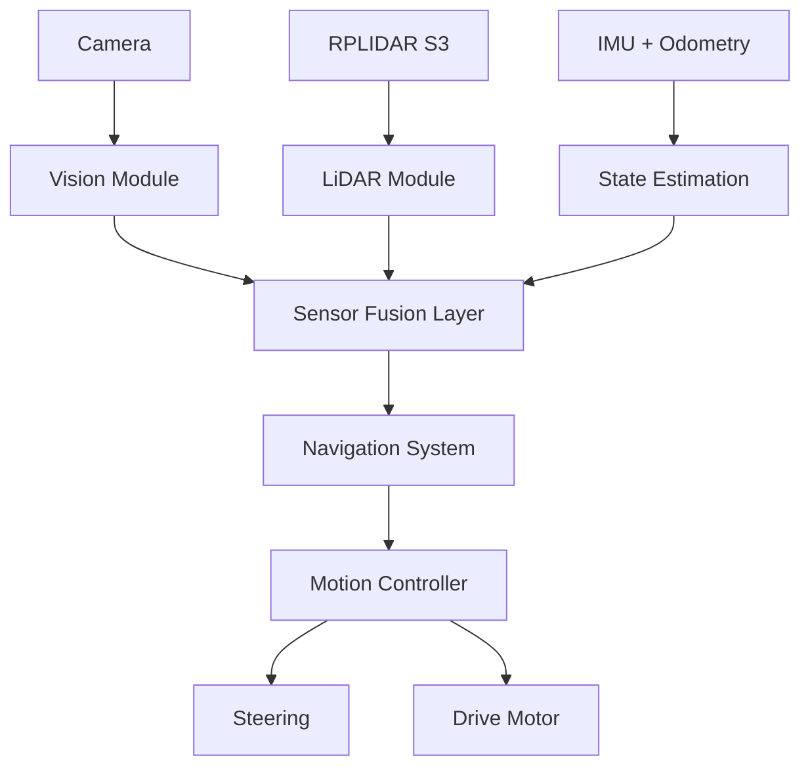

# **KMITL iLARP — WRO Future Engineers 2026**

> Autonomous mobile robot developed by **KMITL iLARP** for the
> **World Robot Olympiad 2026 — Future Engineers** category.

<!-- TODO (team): add the main robot photo to docs/resources/robot_main.jpg -->
<p align="center">
  
</p>

---

## **Team**

**KMITL iLARP** — World Robot Olympiad 2026, Future Engineers category.

> ⚠️ **TODO (team):** List team members (name + role). Example:
>
> | Name       | Role                        |
> | ---------- | --------------------------- |
> | _member 1_ | _software / vision_         |
> | _member 2_ | _mechanical / CAD_          |
> | _member 3_ | _electronics / integration_ |

## **Robot Images**

Photos of the robot from every side are in [`v-photos/`](v-photos/), and team
photos are in [`t-photos/`](t-photos/).

> ⚠️ **TODO (team):** Once the photos are added, embed the six vehicle views
> here (front / back / left / right / top / bottom).

## **Performance Video**

Autonomous-run videos (one per challenge, ≥30 s each) are linked in
[`video/video.md`](video/video.md).

> ⚠️ **TODO (team):**  YouTube links.

## **Documentation**

Detailed per-subsystem engineering documentation lives in
[`docs/`](docs/README.md). Quick links:
[Vision](docs/vision/README.md) ·
[LiDAR](docs/lidar/README.md) ·
[Odometry](docs/odometry/README.md) ·
[Software Architecture](docs/software/README.md) ·
[Mechanical](docs/mechanical/README.md) ·
[Electronics](docs/electronics/README.md).

---

## **Project Overview**

This project presents the design and implementation of an autonomous mobile robot for the **WRO Future Engineers 2026 competition**.

The system integrates:

- Computer Vision for object detection and classification
- LiDAR-based environment perception
- IMU and odometry for motion stability
- Sensor fusion for robust decision making
- Model-based motion control

The robot is designed to operate in structured track environments while maintaining robustness under dynamic obstacles and varying lighting conditions.

---

## **System Architecture**



### System Design Philosophy

The system is built on multi-sensor redundancy, where each sensor contributes a different perspective:

1. Camera → semantic understanding (what and where)
2. LiDAR → geometric understanding (distance and structure)
3. IMU + Odometry → motion consistency (stability and heading)

This separation ensures robustness even when one sensor is degraded.

---

## **Computer Vision System**

The vision system is implemented in C++ with OpenCV, using libcamera/LCCV for image acquisition.

### Processing Pipeline

```text
Frame Capture
   ↓
Color Space Conversion (BGR → HSV)
   ↓
Color Segmentation (Red / Green)
   ↓
Morphological Filtering
   ↓
Contour Extraction
   ↓
Geometric Validation
   ↓
Object Classification
   ↓
Bearing Estimation
```

### Output Features

- Object class (red / green obstacle)
- Bounding box
- Image-space position
- Relative bearing angle

Documentation: `docs/vision/README.md`
Source Code: `code/modules/camera`

---

## **LiDAR Perception System**

The robot uses RPLIDAR S3 for environmental geometry sensing.

### Processing Pipeline

```text
Raw Scan Data
   ↓
Point Filtering
   ↓
Polar → Cartesian Conversion
   ↓
Sector Segmentation
   ↓
Statistical Filtering (Median)
   ↓
Wall Estimation
```

### Output Features

- Front distance
- Left / Right distance
- Wall angle estimation
- Track boundary detection

Documentation: `docs/lidar/README.md`
Source Code: `code/modules/lidar`

---

## **IMU and Odometry System**

The motion estimation system combines:

- IMU angular velocity
- Wheel odometry
- Drift correction logic

### Responsibilities

- Heading stabilization
- Short-term pose estimation
- Motion smoothing for control layer

Documentation: `docs/odometry/README.md`
Source Code: `code/modules/otos`

---

## **Navigation System**

The navigation system operates as a state-driven decision engine.

### Open Challenge Strategy

```text
LiDAR Geometry
   ↓
Wall Alignment
   ↓
Track Center Estimation
   ↓
Trajectory Generation
   ↓
Steering Control
```

### Obstacle Challenge Strategy

```text
Camera (Object Detection)
        ↓
LiDAR (Geometry Context)
        ↓
IMU + Odometry (Stability)
        ↓
Sensor Fusion Layer
        ↓
Navigation State Machine
        ↓
Path Decision
```

Documentation: `docs/software/README.md` (navigation/state-machine layer — planned, see roadmap)

---

## **Motion Control System**

The motion controller converts navigation outputs into actuator commands.

### Components

- Steering control (servo-based)
- Drive motor control
- Speed regulation
- Stability correction loop

### Smooth High-Speed Cornering

The Open Challenge controller follows the outer wall on each straight with a
Stanley controller, then follows a geometric 90-degree heading trajectory at a
corner. It does not command the final heading immediately. Instead, it advances
a moving reference at `yaw_rate = speed / corner_radius` and combines heading
feedback with Ackermann feed-forward:

```text
feed_forward_steering = atan(wheelbase / corner_radius)
corner_speed_limit    = sqrt(max_lateral_acceleration * corner_radius)
```

The current track baseline uses a 0.40 m vehicle-path radius: the field's
0.10 m outer-wall corner radius plus the 0.30 m wall-following offset. Steering
is blended over the first 10 degrees and final 22 degrees of a corner. A
35 ms low-pass filter, a 7 rad/s steering slew limit, acceleration limits, and
a two-frame speed-preview trigger prevent step commands and LiDAR-induced
jitter. The current no-actuator test profile requests 0.85 m/s on a straight,
0.72 m/s on approach, and 0.65 m/s through the corner.

`wheelbase_m` is currently a documented 0.18 m assumption. The team must
measure rear-axle-center to front-axle-center distance on the final chassis and
update this value before physical track tuning. `test_lidar` only visualizes
navigation outputs; it intentionally sends no motor or servo commands.

A deterministic kinematic-bicycle simulation covers both clockwise and
counter-clockwise turns:

```bash
cmake -S code -B build -DILARP_BUILD_TESTS=ON
cmake --build build --target navigation_corner_sim_test
ctest --test-dir build --output-on-failure
```

The simulation checks direction, turn convergence, steering sign, physical
steering limit, non-saturation of the nominal raw command, slew rate, final
heading error, and minimum mid-corner speed. Real-track tuning must still log
lap time, minimum wall clearance, peak heading error, and intervention rate;
speed should only be raised when all clearance runs pass.

Documentation: `docs/software/README.md` (motion-control layer — planned, see roadmap)

---

## **Software Architecture**

The system is implemented in C++17 and structured into modular components.

```text
code/
├── app/                 # test_camera, test_lidar, adjust_HSV, adjust_white, camera_tuner
├── modules/
│   ├── camera/          # CameraModule + CameraProcessor
│   ├── lidar/           # LidarModule + LidarProcessor
│   └── otos/            # OTOS odometry + LinuxI2C
├── external/            # git submodules (see .gitmodules)
│   ├── LCCV/
│   ├── rplidar_sdk/
│   ├── OTOS/
│   └── SparkFunToolkit/
├── utils/               # RingBuffer.hpp
├── build_n_deploy.sh
├── CMakeLists.txt
├── Dockerfile.compile
└── Dockerfile.cross
```

See [`docs/software/README.md`](docs/software/README.md) for the full
architecture, threading model, and module/processor split.

### Core Technologies

| No  | Technology  | Purpose                          |
| --- | ----------- | -------------------------------- |
| 1   | C++17       | Core system implementation       |
| 2   | OpenCV      | Vision processing                |
| 3   | libcamera   | Camera interface                 |
| 4   | LCCV        | Camera wrapper                   |
| 5   | RPLIDAR SDK | LiDAR interface                  |
| 6   | CMake       | Build system                     |
| 7   | Docker      | Cross-platform build environment |

---

## **Build & Deploy**

The robot runs on a **Raspberry Pi 5 (arm64)**. The code is cross-compiled on a
development machine inside Docker and then copied to the Pi — see
[`docs/software/README.md`](docs/software/README.md) for details.

**1. Clone with submodules** (the SDKs under `code/external/` are git
submodules):

```bash
git clone --recurse-submodules <repo-url>
# or, if already cloned:
git submodule update --init --recursive
```

**2. Cross-build and deploy** (edit `PI_USER` / `PI_IP` / `PI_TARGET_DIR` at the
top of the script first):

```bash
cd code
./build_n_deploy.sh          # incremental cross-build + rsync to the Pi
./build_n_deploy.sh cross    # (re)build the cross-compiler Docker image
./build_n_deploy.sh clean    # remove build artifacts
```

The script runs CMake + Ninja (with ccache) inside the `cross-pi` container,
installs to `code/dist/install`, then `rsync`s the result to the Pi over SSH.

> ⚠️ **TODO (team):** Note the exact OS image / dependencies installed on the Pi
> (libcamera, OpenCV runtime) and how each test/challenge binary is launched on
> the robot, so a judge can reproduce a run.

---

## **Mechanical Design**

The mechanical system is designed in SolidWorks with focus on:

- Compact chassis design
- Stable weight distribution
- Efficient steering geometry
- Modular sensor mounting

### Components

1. Chassis structure
2. Steering mechanism
3. Differential drivetrain
4. Motor mounts
5. Sensor mounts (Camera + LiDAR)

CAD Files: `CAD/`
Documentation: `docs/mechanical/README.md`

---

## **Hardware System**

| No  | Component      | Function                      |
| --- | -------------- | ----------------------------- |
| 1   | Raspberry Pi   | Main compute unit             |
| 2   | Camera         | Vision sensing                |
| 3   | RPLIDAR S3     | Distance and geometry sensing |
| 4   | IMU            | Orientation tracking          |
| 5   | Wheel Odometry | Motion estimation             |
| 6   | Servo Motor    | Steering control              |
| 7   | DC Motor       | Propulsion                    |

Documentation: `docs/electronics/README.md`

---

## **Development Tools**

### Vision Tools

- adjust_HSV → color calibration
- adjust_white → white balance tuning
- camera_tuner → camera parameter tuning
- test_camera → camera validation

### LiDAR Tools

- test_lidar → scan validation and debugging

Tools Directory: `code/app/`

---

## **Repository Structure**

```text
KMITL_iLARP__FutureEngineer.WRO2026/
├── CAD/                 # SolidWorks / STEP mechanical models
├── code/
│   ├── app/             # test & calibration tools
│   ├── modules/         # camera, lidar, otos (hardware + processing)
│   ├── external/        # vendored SDKs (git submodules)
│   └── utils/           # RingBuffer
├── docs/
│   ├── vision/          # camera pipeline & detection
│   ├── lidar/           # scan processing, walls, obstacles
│   ├── odometry/        # OTOS pose
│   ├── software/        # architecture, threading, build/deploy, roadmap
│   ├── mechanical/      # chassis, steering, drivetrain
│   └── electronics/     # components, wiring, power budget
├── README.md
└── LICENSE
```

---

## **Documentation Structure**

1. Each subsystem has its own documentation
2. Main README acts as system overview only
3. Technical details are separated into modules

Full documentation index: `docs/README.md`

---

## **WRO Future Engineers 2026**

The system is designed under the principle:

> Vision provides semantics, LiDAR provides geometry, IMU provides stability, and fusion enables intelligence.

---

KMITL iLARP — WRO Future Engineers 2026
Autonomous Robotics • Computer Vision • LiDAR • Embedded Systems
