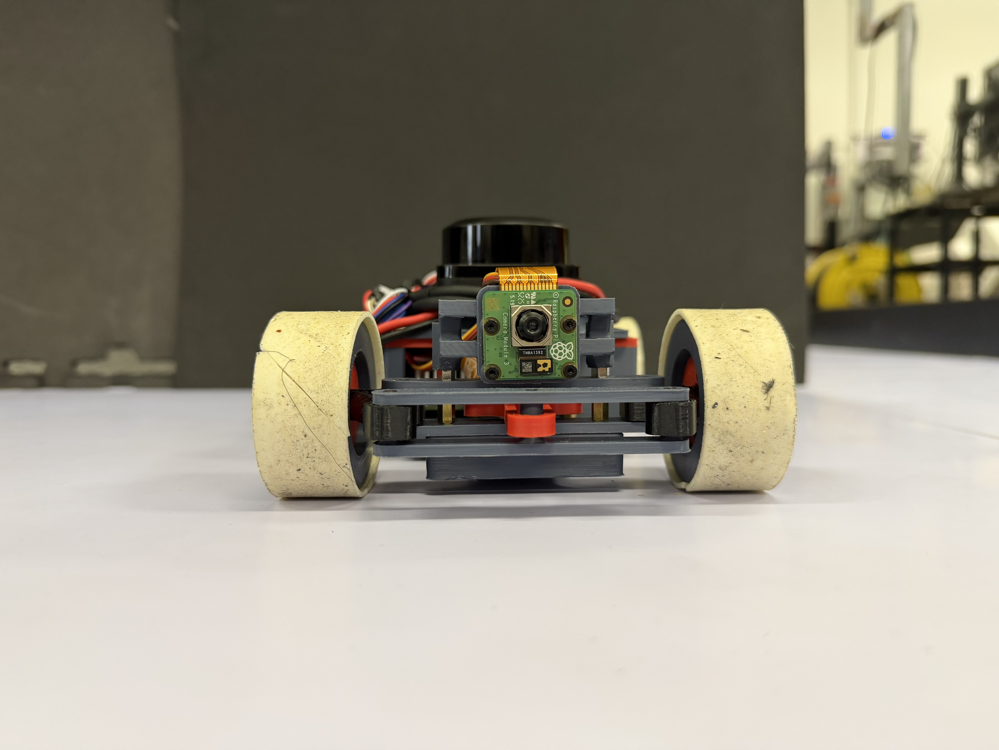
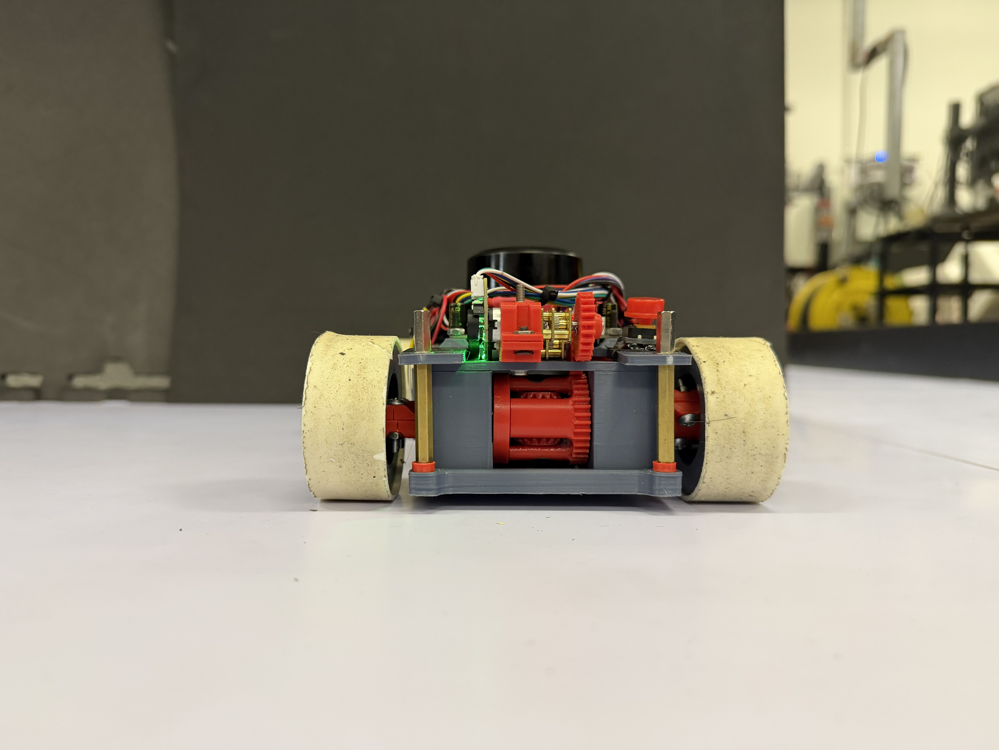
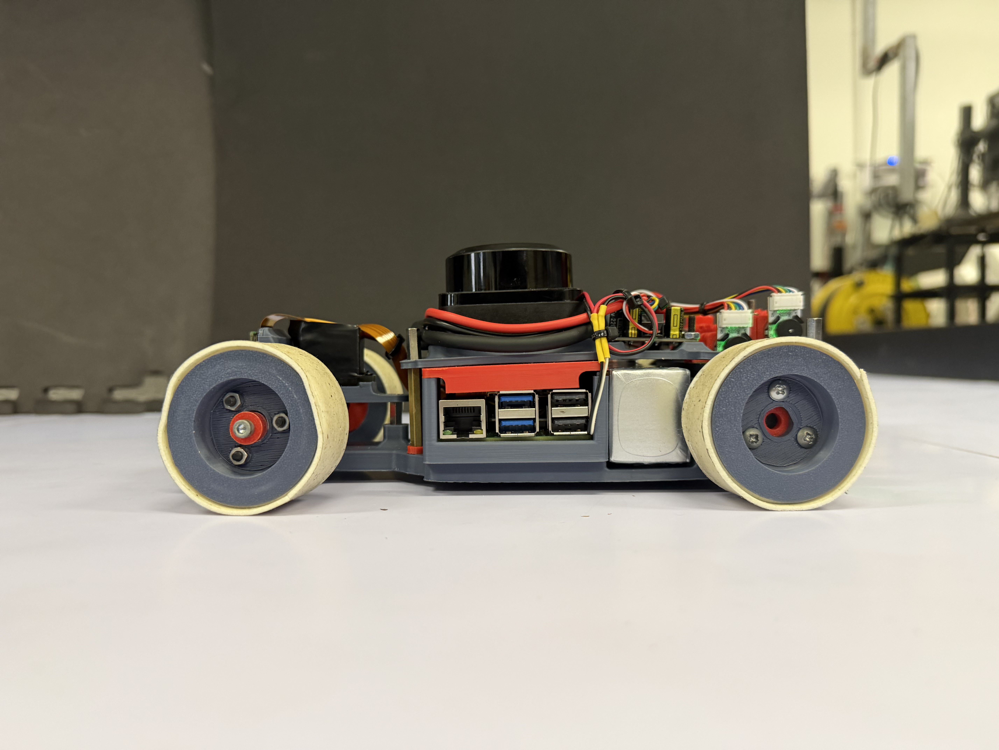
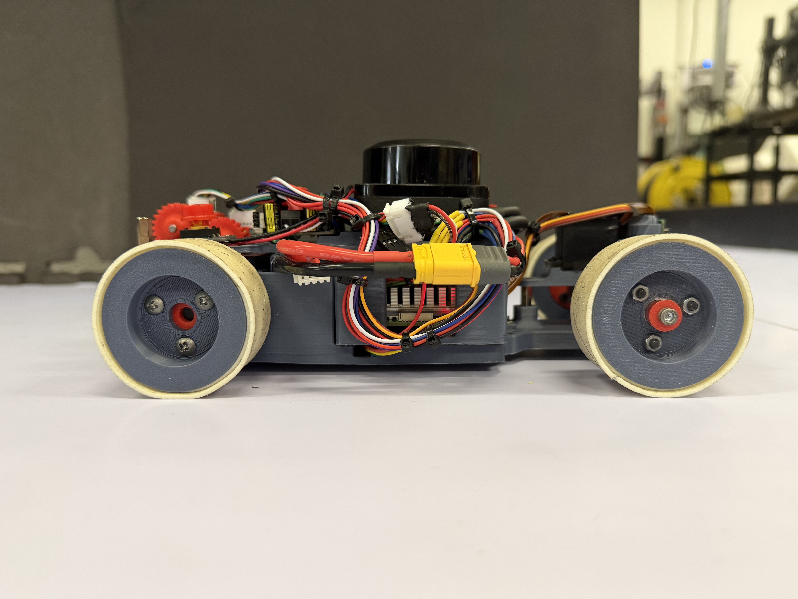
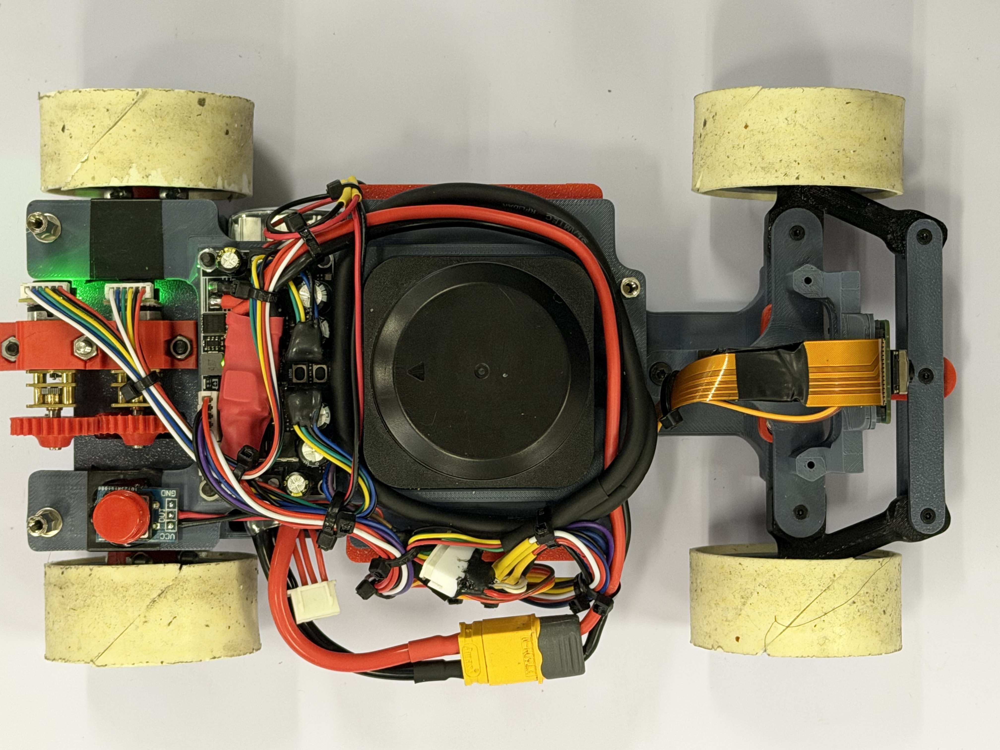
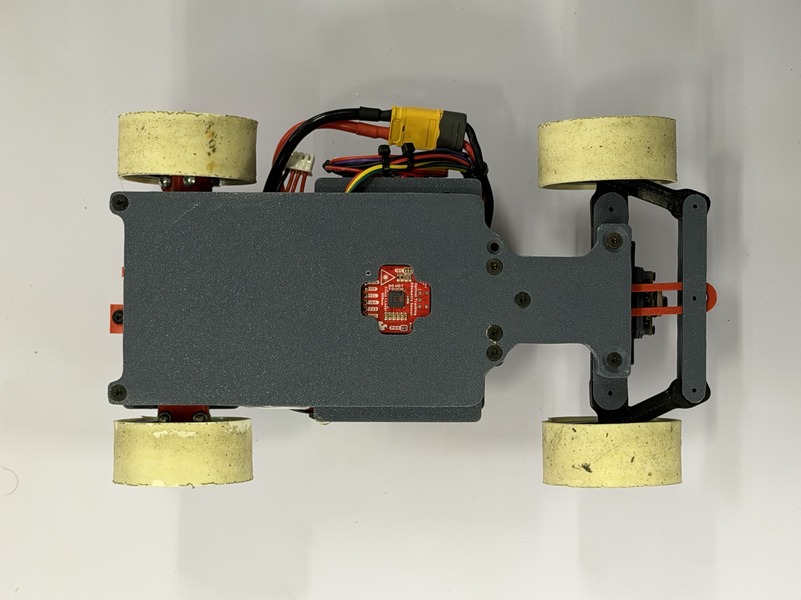
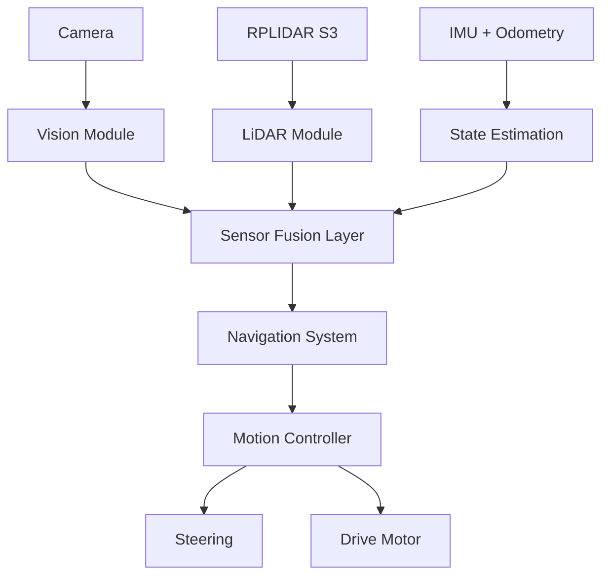

# **KMITL iLARP — WRO Future Engineers 2026**

> Autonomous mobile robot developed by **KMITL iLARP** for the
> **World Robot Olympiad 2026 — Future Engineers** category.

---

## **Team**

**KMITL iLARP** — World Robot Olympiad 2026, Future Engineers category.

The repository identifies the team as **KMITL iLARP**. Individual names and
roles are not stored in the source tree.

## **Robot Images**

The robot combines camera vision, LiDAR, odometry, and model-based control in a
compact four-wheel platform. Explore the complete six-view build below or open
the full-resolution originals in [`v-photos/`](v-photos/).

<table>
  <tr>
    <td align="center"><a href="v-photos/front.jpg"></a><br><sub><strong>Front</strong> </sub></td>
    <td align="center"><a href="v-photos/back.jpg"></a><br><sub><strong>Back</strong> </sub></td>
    <td align="center"><a href="v-photos/left_side.jpg"></a><br><sub><strong>Left side</strong> </sub></td>
  </tr>
  <tr>
    <td align="center"><a href="v-photos/right.jpg"></a><br><sub><strong>Right side</strong> </sub></td>
    <td align="center"><a href="v-photos/top.jpg"></a><br><sub><strong>Top</strong> · Sensor layout</sub></td>
    <td align="center"><a href="v-photos/bottom.jpg"></a><br><sub><strong>Bottom</strong> </sub></td>
  </tr>
</table>

## **Performance Video**

Open Challenge link:

Obstacle Challenge link:

## **Documentation**

Detailed per-subsystem engineering documentation lives in
[`docs/`](docs/README.md). Quick links:
[Vision](docs/vision/README.md) ·
[LiDAR](docs/lidar/README.md) ·
[Odometry](docs/odometry/README.md) ·
[Perception](docs/perception/README.md) ·
[Navigation](docs/navigation/README.md) ·
[Control](docs/control/README.md) ·
[SPI](docs/spi/README.md) ·
[Logging](docs/logging/README.md) ·
[Software Architecture](docs/software/README.md) ·
[Mechanical](docs/mechanical/README.md) ·
[Electronics](docs/electronics/README.md).

---

## **Project Overview**

This project presents the design and implementation of an autonomous mobile robot for the **WRO Future Engineers 2026 competition**.

The system integrates:

- Computer Vision for object detection and classification
- LiDAR-based environment perception
- IMU and odometry for motion stability
- Sensor fusion for robust decision making
- Model-based motion control

The robot is designed to operate in structured track environments while maintaining robustness under dynamic obstacles and varying lighting conditions.

---

## **System Architecture**



### System Design Philosophy

The system is built on multi-sensor redundancy, where each sensor contributes a different perspective:

1. Camera → semantic understanding (what and where)
2. LiDAR → geometric understanding (distance and structure)
3. IMU + Odometry → motion consistency (stability and heading)

This separation ensures robustness even when one sensor is degraded.

---

## **Computer Vision System**

The vision system is implemented in C++ with OpenCV, using libcamera/LCCV for image acquisition.

### Processing Pipeline

```text
Frame Capture
   ↓
Color Space Conversion (BGR → HSV)
   ↓
Color Segmentation (Red / Green)
   ↓
Morphological Filtering
   ↓
Contour Extraction
   ↓
Geometric Validation
   ↓
Object Classification
   ↓
Bearing Estimation
```

### Output Features

- Object class (red / green obstacle)
- Bounding box
- Image-space position
- Relative bearing angle

Documentation: `docs/vision/README.md`
Source Code: `code/modules/camera`

---

## **LiDAR Perception System**

The robot uses RPLIDAR S3 for environmental geometry sensing.

### Processing Pipeline

```text
Raw Scan Data
   ↓
Point Filtering
   ↓
Polar → Cartesian Conversion
   ↓
Sector Segmentation
   ↓
Statistical Filtering (Median)
   ↓
Wall Estimation
```

### Output Features

- Front distance
- Left / Right distance
- Wall angle estimation
- Track boundary detection

Documentation: `docs/lidar/README.md`
Source Code: `code/modules/lidar`

---

## **IMU and Odometry System**

The motion estimation system combines:

- IMU angular velocity
- Wheel odometry
- Drift correction logic

### Responsibilities

- Heading stabilization
- Short-term pose estimation
- Motion smoothing for control layer

Documentation: `docs/odometry/README.md`
Source Code: `code/modules/otos`

---

## **Navigation System**

The navigation system operates as a state-driven decision engine.

### Open Challenge Strategy

```text
LiDAR Geometry
   ↓
Wall Alignment
   ↓
Track Center Estimation
   ↓
Trajectory Generation
   ↓
Steering Control
```

### Obstacle Challenge Strategy

```text
Camera (Object Detection)
        ↓
LiDAR (Geometry Context)
        ↓
IMU + Odometry (Stability)
        ↓
Sensor Fusion Layer
        ↓
Navigation State Machine
        ↓
Path Decision
```

Documentation: `docs/navigation/README.md` (state machine, corner trajectory, track map)
Source Code: `code/modules/navigation`

---

## **Motion Control System**

The motion controller converts navigation outputs into actuator commands.

### Components

- Steering control (servo-based)
- Drive motor control
- Speed regulation
- Stability correction loop

Documentation: `docs/control/README.md` (PID + Stanley) · `docs/spi/README.md` (STM32 link)
Source Code: `code/control`, `code/modules/spi`

---

## **Software Architecture**

The system is implemented in C++17 and structured into modular components.

```text
code/
├── common/              # direction.hpp (DrivingDirection, TurnDirection)
├── app/
│   ├── _challenge/open/ # open_challenge_main (learn+replay) + actuator
│   ├── test_camera/ test_lidar/ test_perception/ test_otos/ test_spi/
│   └── adjust_HSV/ adjust_white/ camera_tuner/
├── modules/
│   ├── camera/          # CameraModule + CameraProcessor
│   ├── lidar/           # LidarModule + LidarProcessor (walls, obstacles, parking)
│   ├── otos/            # OTOS odometry + LinuxI2C
│   ├── perception/      # camera + LiDAR fusion → FusedObstacle
│   ├── navigation/      # state machine, corner trajectory, init_direction, track_map
│   ├── spi/             # SPI master → STM32 (motor/servo/battery)
│   └── logging/         # async CSV telemetry (Logger V1)
├── control/             # PID + Stanley controllers
├── external/            # git submodules (see .gitmodules)
│   ├── LCCV/ rplidar_sdk/ OTOS/ SparkFunToolkit/
├── utils/               # RingBuffer.hpp
├── build_n_deploy.sh
├── CMakeLists.txt
├── Dockerfile.compile
└── Dockerfile.cross
```

See [`docs/software/README.md`](docs/software/README.md) for the full
architecture, threading model, and module/processor split.

### Core Technologies

| No  | Technology  | Purpose                          |
| --- | ----------- | -------------------------------- |
| 1   | C++17       | Core system implementation       |
| 2   | OpenCV      | Vision processing                |
| 3   | libcamera   | Camera interface                 |
| 4   | LCCV        | Camera wrapper                   |
| 5   | RPLIDAR SDK | LiDAR interface                  |
| 6   | CMake       | Build system                     |
| 7   | Docker      | Cross-platform build environment |

---

## **Build & Deploy**

The robot runs on a **Raspberry Pi 5 (arm64)**. The code is cross-compiled on a
development machine inside Docker and then copied to the Pi — see
[`docs/software/README.md`](docs/software/README.md) for details.

**1. Clone with submodules** (the SDKs under `code/external/` are git
submodules):

```bash
git clone --recurse-submodules <repo-url>
# or, if already cloned:
git submodule update --init --recursive
```

**2. Cross-build and deploy** (edit `PI_USER` / `PI_IP` / `PI_TARGET_DIR` at the
top of the script first):

```bash
cd code
./build_n_deploy.sh          # incremental cross-build + rsync to the Pi
./build_n_deploy.sh cross    # (re)build the cross-compiler Docker image
./build_n_deploy.sh clean    # remove build artifacts
```

The script runs CMake + Ninja (with ccache) inside the `cross-pi` container,
installs to `code/dist/install`, then `rsync`s the result to the Pi over SSH.

The deployment script targets Raspberry Pi 5, but the exact OS image and
runtime package list are not recorded in this repository. The installed Open
Challenge executable is `challenge/open/open_challenge_main`; test and tuning
executables are installed from their corresponding `code/app/*/CMakeLists.txt`.

---

## **Mechanical Design**

The mechanical system is designed in SolidWorks with focus on:

- Compact chassis design
- Stable weight distribution
- Efficient steering geometry
- Modular sensor mounting

### Components

1. Chassis structure
2. Steering mechanism
3. Differential drivetrain
4. Motor mounts
5. Sensor mounts (Camera + LiDAR)

CAD Files: `CAD/`
Documentation: `docs/mechanical/README.md`

---

## **Hardware System**

| No  | Component      | Function                      |
| --- | -------------- | ----------------------------- |
| 1   | Raspberry Pi   | Main compute unit             |
| 2   | Camera         | Vision sensing                |
| 3   | RPLIDAR S3     | Distance and geometry sensing |
| 4   | IMU            | Orientation tracking          |
| 5   | Wheel Odometry | Motion estimation             |
| 6   | Servo Motor    | Steering control              |
| 7   | DC Motor       | Propulsion                    |

Documentation: `docs/electronics/README.md`

---

## **Development Tools**

### Vision Tools

- adjust_HSV → color calibration
- adjust_white → white balance tuning
- camera_tuner → camera parameter tuning
- test_camera → camera validation

### LiDAR Tools

- test_lidar → scan validation and debugging

Tools Directory: `code/app/`

---

## **Repository Structure**

```text
KMITL_iLARP__FutureEngineer.WRO2026/
├── CAD/                 # SolidWorks / STEP mechanical models
├── code/
│   ├── common/          # shared enums
│   ├── app/             # challenge programs + test & calibration tools
│   ├── modules/         # camera, lidar, otos, perception, navigation, spi, logging
│   ├── control/         # PID + Stanley
│   ├── external/        # vendored SDKs (git submodules)
│   └── utils/           # RingBuffer
├── docs/
│   ├── vision/  lidar/  odometry/       # perception
│   ├── perception/  navigation/  control/  spi/  logging/   # decision + actuation
│   ├── software/                        # architecture, build/deploy
│   ├── mechanical/  electronics/        # hardware
│   └── resources/                       # images referenced by the docs
├── t-photos/  v-photos/  video/         # required WRO submissions
├── README.md
└── LICENSE
```

---

## **Documentation Structure**

1. Each subsystem has its own documentation
2. Main README acts as system overview only
3. Technical details are separated into modules

Full documentation index: `docs/README.md`

---

## **WRO Future Engineers 2026**

The system is designed under the principle:

> Vision provides semantics, LiDAR provides geometry, IMU provides stability, and fusion enables intelligence.

---

KMITL iLARP — WRO Future Engineers 2026
Autonomous Robotics • Computer Vision • LiDAR • Embedded Systems
