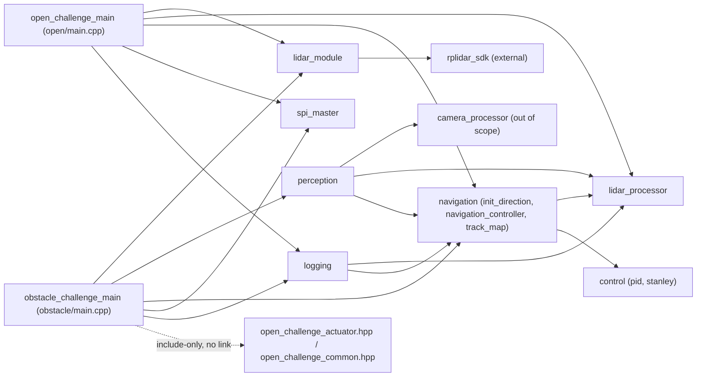

# Audit Report 2 — Coupling, Conflicts, and Findings

Depends on `docs/audit/01_conventions_and_control_path.md` (convention ledger,
B1 traces, B2/B3 tables). Read-only audit; no source files were modified.

---

## 1. Findings (most severe first)

### F-01 — `exit_acceleration_blend_rad` unit bug defeats the corner speed cap

- **Severity:** CRITICAL
- **Status:** CONFIRMED (= S1)
- **Location:** `code/app/_challenge/open/open_challenge_common.hpp:95`; compare
  `code/modules/navigation/navigation_controller.hpp:98` (default) and
  `code/modules/navigation/navigation_controller.cpp:442-446` (consumer)
- **What the code does:** The default is
  `exit_acceleration_blend_rad{15.0f * PI / 180.0f}` (≈0.262 rad), and every
  neighbouring blend field in the same override function is written the same
  way (`turn_entry_blend_rad = 22.5f * PI/180.0f`, `turn_exit_blend_rad = 32.0f
  * PI/180.0f`, `heading_tolerance_rad = 16.50f * PI/180.0f`). The override is
  `config.exit_acceleration_blend_rad = 20.0f;` — a bare `20.0f`, i.e. **20
  radians**, not 20 degrees. It is consumed at
  `navigation_controller.cpp:442-446`:
  ```cpp
  const float exit_acceleration_weight =
      config_.exit_acceleration_blend_rad > 1e-6f ? 1.0f -
          smoothstep(std::abs(heading_error_rad) / config_.exit_acceleration_blend_rad)
                                                    : 0.0f;
  command.target_speed_mps = corner_speed_mps +
      (calculate_active_normal_speed_mps() - corner_speed_mps) * exit_acceleration_weight;
  ```
- **Failure scenario:** At corner entry `heading_error_rad ≈ 90° = 1.5708
  rad`. With the intended 15° (0.262 rad) reading:
  `x = 1.5708/0.262 = 5.99` → `smoothstep` clamps to 1 → `weight = 0` →
  `target_speed_mps = corner_speed_mps` exactly, as designed (full corner
  speed for the whole turn, ramping to normal speed only in roughly the last
  15° of heading error). With the actual 20-**radian** value: `x =
  1.5708/20 = 0.0785` → `smoothstep(0.0785) ≈ 0.0175` → `weight ≈ 0.9825` —
  i.e. **from the very start of the turn**, `target_speed_mps ≈ corner_speed_mps
  + 0.9825·(active_normal_speed_mps − corner_speed_mps)`, essentially the
  *normal straight-line speed*, not the corner-safe speed. With the current
  open-challenge config (`normal_speed_mps=0.45`, corner speed capped at
  `min(turning_speed_mps=0.28, sqrt(max_lateral_acceleration_mps2=0.50 ·
  corner_radius_m=0.12)) = min(0.28, 0.245) = 0.245 m/s`), the robot requests
  ≈0.44 m/s through nearly the entire corner instead of ≈0.245 m/s — an ~80%
  speed excess above the lateral-acceleration-derived safe corner speed for
  the whole turn duration, not just its very end.
- **Why it conflicts:** It defeats `calculate_corner_speed_mps()`'s entire
  purpose (`sqrt(max_lateral_acceleration_mps2 · corner_radius_m)`, the one
  physically-grounded speed cap in the corner path) for nearly the whole
  turn. It also fights the geometric feed-forward/PID steering, which is
  tuned assuming corner-speed cornering, not near-normal-speed cornering.
- **Proposed direction:** Change the override to `20.0f * PI / 180.0f`,
  matching the pattern of every neighbouring field in the same function.

### F-02 — Obstacle avoidance skips `navigation.update()` and `condition_command()` entirely

- **Severity:** CRITICAL
- **Status:** CONFIRMED (= S2, and drives S3)
- **Location:** `code/app/_challenge/obstacle/main.cpp:252-258`
- **What the code does:**
  ```cpp
  navigation::NavigationResult result;
  if (obstacle_status.active) {
      result.command = priority_command;
  } else {
      result = navigation.update(processed_lidar, heading_rad, speed_mps, replay_hint, pose);
  }
  ```
- **Failure scenario:** While `obstacle_status.active` is true, the entire
  `NavigationController::update()` — mode dispatch, turn-trigger evaluation,
  `should_start_turn()`, the moving-heading-reference corner model, wall-corner
  landmark tracking, and `condition_command()` (steering low-pass filter,
  `max_steering_rate_rad_s` slew limit, `clamp_steering()`, speed ramp) — does
  not execute for as long as avoidance stays active. Concretely: if the robot
  enters `TURNING` and an obstacle is then confirmed mid-corner,
  `turn_reference_progress_rad_`/`state_.mode` freeze at whatever they were
  when avoidance started (see report 01 §4, B3 table) and do not resume until
  avoidance releases — the robot can physically traverse the corner steered
  entirely by the obstacle controller while the navigation controller's
  internal model of "where in the corner am I" does not move at all.
- **Why it conflicts:** It fights the corner state machine (B3/S6) and the
  command-conditioning stage (F-03) simultaneously — two independent safety
  mechanisms (turn-progress tracking, output smoothing) are silently disabled
  for the duration of every avoidance event, with no compensating logic
  elsewhere.
- **Proposed direction:** Call `navigation.update()` unconditionally every
  tick (as `open/main.cpp` already does), and let the obstacle controller
  *override* the resulting command (blend or replace `result.command.steering_rad`
  post-hoc) rather than pre-empting the call. This keeps `dt` accounting,
  turn-progress tracking, and the wall-corner tracker alive during avoidance,
  and lets avoidance output still pass through `condition_command()` for
  smoothing (see F-03).

### F-03 — Avoidance steering bypasses all output shaping (filter, slew limit, Stanley-derived clamp)

- **Severity:** CRITICAL
- **Status:** CONFIRMED
- **Location:** `code/app/_challenge/obstacle/main.cpp:252-258` (root cause,
  same as F-02) combined with `code/app/_challenge/obstacle/obstacle_controller.hpp:119-133`
  (`ObstacleController::apply`, direct assignment to `command.steering_rad`)
- **What the code does:** Because `navigation.update()` does not run while
  avoidance is active (F-02), `priority_command` — including
  `avoidance_steering_rad`/`emergency_steering_rad` — is handed straight to
  `actuators.apply(result.command, wheel_rpm_override)`
  (`obstacle/main.cpp:324`) without ever reaching
  `NavigationController::condition_command()`.
- **Failure scenario:** Suppose the robot is driving straight with
  `conditioned_steering_rad_` near 0, and on one tick an obstacle transitions
  straight to the emergency branch (`relative.forward_m ≤
  emergency_distance_m = 0.35 m`, reachable in a single tick if
  `confirmation_frames` conditions are met or the emergency short-circuit
  fires — see F-17). The commanded steering jumps to
  `side · emergency_steering_rad = ±32°` in one tick, with **no**
  `steering_filter_time_constant_s` low-pass and **no**
  `max_steering_rate_rad_s` (3.0 rad/s in the open config) slew limit — the
  two mechanisms that exist specifically to prevent step changes at the
  servo. The only remaining protections are the actuator's own
  `maximum_servo_step_us=500 µs`/tick hard clip (an abrupt clip, not a smooth
  limit) and `maximum_steering_command_deg=45°`.
- **Why it conflicts:** It defeats the entire purpose of
  `condition_command()`'s steering shaping stage, which `docs/navigation/README.md`
  §6 documents as removing jitter and preventing "step commands" — exactly the
  kind of command an emergency avoidance event produces.
- **Proposed direction:** Route the obstacle-avoidance command through the
  same `condition_command()` stage used by normal driving (this falls out
  naturally once F-02 is fixed to call `update()` unconditionally and blend
  afterward), or add an explicit, independently-tuned slew limit inside
  `ObstacleController::apply()` if bypassing the navigation-side filter is
  intentional.

### F-04 — Corner feed-forward (53.8°) exceeds the steering clamp (38°) with the currently configured geometry

- **Severity:** CRITICAL
- **Status:** CONFIRMED (= S9)
- **Location:** `code/modules/navigation/navigation_controller.cpp:423-424`
  (`feedforward_magnitude_rad = atan2(max(0.01,wheelbase_m), radius_m)`);
  configured values at `code/app/_challenge/open/open_challenge_common.hpp:84`
  (`corner_radius_m = 0.12f`, `wheelbase_m` left at the
  `navigation_controller.hpp:88` default of `0.16375f`); clamp at
  `code/app/_challenge/open/open_challenge_common.hpp:101`
  (`stanley.max_steering_rad = 38.0f * PI/180.0f`), applied by
  `NavigationController::clamp_steering()` (`navigation_controller.cpp:1202-1206`)
- **What the code does:** `atan2(0.16375, 0.12) = 0.9391 rad = 53.8°`. This is
  the feed-forward's magnitude *before* entry/exit blending and *before*
  `turn_heading_pid`'s tracking correction are added, and the whole sum is
  then clamped to ±38° by `clamp_steering()`.
- **Failure scenario:** Through the entry/exit-blend "plateau" of a turn
  (`entry_weight≈exit_weight≈1`, the middle of the corner), the feed-forward
  term alone (53.8°) already exceeds the ±38° clamp before
  `turn_heading_pid`'s tracking-error correction is even added. Any
  correction the tracking PID tries to add (up to its own ±45° limit, itself
  larger than 38° — see F-16) has **zero effect on the commanded output**
  whenever the feed-forward's sign matches the saturation direction, because
  the sum is already pinned at the clamp. The turn-heading PID becomes unable
  to correct heading error mid-corner exactly when it is most needed.
- **Why it conflicts:** It silently disables `turn_heading_pid` (tuned in
  `open_challenge_common.hpp:108-110`) for a large fraction of every turn,
  which fights B4/B5's assumption that the tracking PID provides a live
  correction throughout the corner.
- **Proposed direction:** Either raise `stanley.max_steering_rad` /
  `clamp_steering()`'s limit to comfortably exceed the feed-forward magnitude
  (and confirm the physical steering rack can actually reach that angle), or
  increase `corner_radius_m` / decrease reliance on `wheelbase_m` so
  `atan2(wheelbase_m, corner_radius_m)` sits with margin under the clamp.
  `docs/control/README.md` and `tune.txt` both already document this exact
  relationship (`atan(wheelbase/radius)`) as the thing to check before
  tightening `corner_radius_m`; the currently configured value violates it.

### F-05 — Obstacle avoidance runs during `TURNING`, replacing the corner feed-forward

- **Severity:** HIGH
- **Status:** CONFIRMED (= S6)
- **Location:** `code/app/_challenge/obstacle/obstacle_controller.hpp:50-60`
  (`apply()`'s only early-return is `mode == NavigationMode::FINISHED`)
- **What the code does:** No check excludes `NavigationMode::TURNING` (or
  `SEARCH_DIRECTION`) from avoidance activation.
- **Failure scenario:** If a traffic-light obstacle is confirmed while
  `state.mode == TURNING`, `ObstacleController::apply()` still activates and
  (per F-02/F-03) its steering command entirely replaces the corner's
  feed-forward + moving-heading-reference tracking for as long as avoidance
  stays active — the robot stops following the intended constant-radius arc
  and instead points at the obstacle's pass offset, potentially cutting the
  corner short or swinging wide relative to the physical corner geometry,
  with no feed-forward term counteracting the Ackermann geometry of the turn.
- **Why it conflicts:** Fights the entire TURNING-mode design documented in
  `docs/navigation/README.md` §5 (geometric corner trajectory, entry/exit
  blending) — that design assumes it is the sole author of steering during a
  turn.
- **Proposed direction:** Gate `ObstacleController::apply()` on
  `mode == NavigationMode::NORMAL` (or add `TURNING`/`SEARCH_DIRECTION` to the
  early-return set), or — if avoidance must be allowed mid-corner for rules
  reasons — blend the avoidance offset into the corner feed-forward rather
  than replacing it.

### F-06 — Obstacle avoidance replaces steering unconditionally with no wall-following blending

- **Severity:** HIGH
- **Status:** CONFIRMED (= S5)
- **Location:** `code/app/_challenge/obstacle/obstacle_controller.hpp:119-133`
- **What the code does:** `command.steering_rad = avoidance_steering_rad;` /
  `command.steering_rad = side * emergency_steering_rad;` — plain assignment,
  not a blend with any wall-relative signal, and (per F-02) `command` is not
  the navigation controller's wall-following output to begin with once
  avoidance is active (it is `priority_command`, seeded only with
  `target_speed_mps`).
- **Failure scenario:** `avoidance_steering_rad = atan2(target_right_m,
  lookahead_m)` is computed purely from the obstacle's position and the
  configured `pass_clearance_m` (0.32 m); it has no term referencing the
  outer-wall distance or lane width. If the obstacle sits close to the outer
  wall (a legal placement) and `pass_clearance_m` pushes `target_right_m`
  toward — or past — the wall, nothing in this code path detects or prevents
  steering into the outer wall; the wall-following controller that normally
  guards against that is not running (F-02).
- **Why it conflicts:** Fights `NavigationController`'s wall-following
  invariant (`target_outer_distance_m`) that every other mode maintains.
- **Proposed direction:** Clamp `target_right_m` (or the resulting steering)
  against the live outer-wall distance from `perception_data.track_walls`,
  which is already available in `PerceptionData` passed into `apply()`, so
  the avoidance maneuver cannot request a path closer to the outer wall than
  the wall-following target.

### F-07 — `polar2cartesian` contradicts the documented LiDAR frame convention

- **Severity:** HIGH
- **Status:** CONFIRMED (convention mismatch) / NEEDS HARDWARE (to determine which side is correct)
- **Location:** `code/modules/lidar/lidar_processor.cpp:135-143`; compare
  `/home/jukkruw/iLARP/mark.txt` and `docs/lidar/README.md:109-114`
- **What the code does:** See report 01 §2.1 for the full algebraic
  derivation. In short: `x_m = -distance·sin(rad); y_m = -distance·cos(rad)`,
  a 180°-rotated (point-reflected) version of the formula both cited
  documents specify (`x=distance·sin(angle), y=distance·cos(angle)`).
- **Failure scenario:** If the physical LiDAR's raw `angle_deg=0` axis really
  does point toward the robot's front (as `mark.txt` states), then every
  point the pipeline places is diametrically wrong: a wall physically ahead
  of the robot (`y_m` should be positive/"front") would be computed with
  `y_m` negative and therefore **never** classified as the front wall by
  `resolve_track_walls` (`center.y > 0` requirement), while a physically rear
  return would be. This would make front-wall detection (used by
  `should_start_turn`'s LEGACY_FRONT/FRONT_FALLBACK paths and by the
  approach-speed slowdown) look at the wrong side of the robot.
- **Why it conflicts:** Directly contradicts the one convention document the
  audit plan calls "load-bearing" (`mark.txt`) and the LiDAR module's own
  README, both of which describe this exact function.
- **Proposed direction:** Verify against hardware: point the RPLIDAR's
  physical raw-angle-zero reference at a known wall and check, in
  `code/app/test_lidar`'s live view, whether that wall renders in front of
  (+Y) or behind (-Y) the drawn robot marker. If it renders behind, either the
  negation in `polar2cartesian` is a deliberate, undocumented mount
  correction (in which case `mark.txt`/`docs/lidar/README.md` need updating to
  match) or it is a genuine bug (in which case remove the two `-` signs). Do
  not change the code from source reading alone — this is exactly the kind of
  change that must be validated against the physical sensor mount.

### F-08 — Two `robot_to_world` implementations differ by a 90° rotation

- **Severity:** HIGH
- **Status:** CONFIRMED (= S4)
- **Location:** `code/modules/perception/perception.cpp:231-246`
  (`Perception::robot_to_world`) vs
  `code/modules/navigation/navigation_controller.cpp:730-736`
  (`NavigationController::update_wall_corner_landmark`, forward transform)
- **What the code does:** See report 01 §2.2 for the full algebraic
  comparison. `perception::robot_to_world` treats robot-forward as aligned
  with +world-X at heading 0; `navigation_controller.cpp`'s wall-corner
  transform treats robot-forward as aligned with +world-Y at heading 0 — a
  constant 90° difference for every heading.
- **Failure scenario:** Both transforms consume the *same* `MapPose` (the
  live OTOS pose) in the *same* process. If a future change starts reading
  `wall_corner_filtered_world_` (currently only used internally, converted
  back to robot-frame by the function's own, self-consistent inverse) through
  code that assumes the `perception::robot_to_world` convention — for example
  feeding a wall-corner world position into `TrackMap` or into
  `ObstacleController`'s landmark matching, both of which are built on the
  `perception`/`obstacle_controller.hpp::to_robot` convention — the position
  would land 90° away from where it should.
- **Why it conflicts:** `obstacle_challenge::ObstacleController::to_robot`
  (`obstacle_controller.hpp:232-239`) is algebraically the exact inverse of
  `perception::robot_to_world` (verified in report 01 §2.2), so 2 of the 3
  transforms in scope already agree; `navigation_controller.cpp`'s is the
  outlier.
- **Proposed direction:** Rewrite `update_wall_corner_landmark`'s forward and
  inverse transforms to match `perception::robot_to_world`'s convention
  (swap the roles of `sin`/`cos` as derived in report 01 §2.2), then verify
  with the same live-heading-hold test named in F-07's proposed direction
  (drive straight, confirm the OTOS-reported world axis matches "forward" on
  the field). This is currently self-consistent internally (candidate world
  position → filtered → inverse-transformed back for
  `wall_corner_forward_m`/`wall_corner_lateral_m`), so today's turn-trigger
  behavior is not broken by this bug in isolation — the risk is entirely in
  future code that cross-references this landmark against
  `perception`/`TrackMap`/`ObstacleController` data.

### F-09 — `target_acceleration_mps2` is computed but never actuated

- **Severity:** HIGH
- **Status:** CONFIRMED (= S8)
- **Location:** `code/modules/navigation/navigation_controller.cpp:1112,1157`
  (`speed_pid_.calculate(...)` inside `condition_command`) vs
  `code/app/_challenge/open/open_challenge_actuator.hpp:79-105`
  (`ActuatorOutput::apply`, uses only `command.target_speed_mps` via
  `to_wheel_rpm()`); `code/modules/spi/spi_master.cpp:85-89`
  (`set_motor_speed` → `Command::M1_SPD`/`M2_SPD`, the STM32's **closed-loop**
  RPM command)
- **What the code does:** `condition_command()` runs `speed_pid_` and returns
  its output as `NavigationCommand::target_acceleration_mps2`, which is
  logged (`TelemetryRow::target_acceleration_mps2`) but `ActuatorOutput::apply`
  reads only `command.target_speed_mps`, open-loop-converts it to RPM via
  `to_wheel_rpm()`, and sends it over SPI as `Command::M1_SPD`/`M2_SPD` — a
  command the STM32 firmware then tracks with its *own* closed encoder loop.
- **Failure scenario:** Tuning `speed_pid.kp/ki/kd` (as `tune.txt` §10
  instructs, and as the "Speed PID" section of `docs/control/README.md`
  describes) has **zero effect on the physical robot's motion** in the
  current wiring — the only thing that actually shapes the commanded speed
  ramp is `condition_command`'s open-loop rate limiter
  (`max_acceleration_mps2`/`max_deceleration_mps2`) followed by the STM32's
  own RPM loop. `speed_pid_`'s output is dead code as far as actuation goes.
- **Why it conflicts:** This resolves — rather than creates — the "do the two
  speed loops fight" question in B6: they cannot fight, because only one
  (the STM32's) is actually closed. But it means every `speed_pid` tuning
  note in `tune.txt`/`docs/control/README.md` is currently inert, which is a
  significant, silent gap between what the tuning documentation instructs and
  what the code does.
- **Proposed direction:** Either wire `target_acceleration_mps2` into the
  actuator (e.g. integrate it into a target RPM delta each tick, replacing or
  supplementing the current open-loop ramp) or remove/relabel `speed_pid` and
  its tuning guidance as not-yet-connected so the team does not spend field
  time tuning gains that cannot change behaviour.

### F-10 — Replay turn gate can suppress a legitimate turn until the front wall is 0.25 m away

- **Severity:** HIGH
- **Status:** CONFIRMED (= S10)
- **Location:** `code/modules/navigation/navigation_controller.cpp:857-869`
- **What the code does:**
  ```cpp
  if (state_.lap >= 1 && replay_hint.has_value() &&
      replay_hint->distance_to_entry_m >
          std::max(0.0f, config_.replay_turn_gate_distance_m)) {
      const bool safety_override = lidar_data.walls.front.has_value() &&
          lidar_data.walls.front->perpendicular_distance() <=
              std::max(0.0f, config_.replay_front_safety_override_distance_m);
      if (!safety_override) {
          trigger_condition = false;
          ...
      }
  }
  ```
  With the open-challenge config, `replay_turn_gate_distance_m = 0.40 m` and
  `replay_front_safety_override_distance_m = 0.25 m`.
- **Failure scenario:** On lap 2/3, if the learned map's corner-entry pose is
  off (e.g. accumulated OTOS drift from lap 1), `replay_hint->distance_to_entry_m`
  can stay above 0.40 m even when the robot is physically much closer to the
  real corner. The live wall-corner/front-wall triggers (which would
  otherwise fire correctly) are then forcibly suppressed
  (`trigger_condition = false`) until the front wall is within 0.25 m — at
  `active_normal_speed_mps` (up to `0.45·lap-factor` m/s in the open config)
  that is roughly half a second of margin before contact, and
  `turn_trigger_confirm_frames` (2 frames) must still elapse after that
  before the turn actually starts, i.e. the corner could genuinely be
  triggered only ~0.1-0.2 s and a fraction of a metre before impact.
- **Why it conflicts:** Fights the live wall-corner/front-wall triggers,
  whose entire purpose (per `docs/NAVIGATION_TUNING_GUIDE_TH.txt` §1) is to
  be the primary, geometry-grounded trigger; the replay gate makes a
  *live-observed*, correctly-firing trigger subordinate to a *stale learned*
  distance estimate.
- **Proposed direction:** Either widen `replay_front_safety_override_distance_m`
  to a value with real stopping/turning margin at the configured speeds, or
  change the gate so a live wall-corner-confirmed trigger (not just the raw
  front-wall distance) can always override the replay gate, since a confirmed
  wall-corner landmark is itself strong live evidence independent of the
  learned map's absolute position.

### F-11 — `clamp_steering()` makes the Stanley config a global steering limit

- **Severity:** MEDIUM
- **Status:** CONFIRMED (= C2 item 1)
- **Location:** `code/modules/navigation/navigation_controller.cpp:1202-1206`
  (`clamp_steering()` reads `config_.stanley.max_steering_rad`); called from
  `calculate_search_steering` (line 1197), `update_turning` (line 439-440),
  and `condition_command` (line 1138, 1152) — i.e. every mode
- **What the code does:** `clamp_steering()` is the single steering clamp
  used by `SEARCH_DIRECTION`, `TURNING`, and the final `condition_command()`
  stage that every mode passes through — none of which involve the Stanley
  controller (only `NORMAL` does).
- **Failure scenario:** A team member tuning wall-following aggressiveness by
  raising `stanley.max_steering_rad` (intending only to let the Stanley
  controller correct harder in `NORMAL`) simultaneously raises the ceiling
  available to `TURNING`'s feed-forward+PID sum and to `SEARCH_DIRECTION`'s
  centring steering — an unrelated-looking config change with a
  track-wide side effect.
- **Why it conflicts:** `stanley.max_steering_rad` reads as scoped to the
  Stanley controller (it lives in `StanleyConfig`); its use as the *only*
  steering ceiling in the whole system is not evident from the config
  structure.
- **Proposed direction:** Add a `NavigationConfig::max_steering_rad` (or
  similarly-named, mode-independent) field and have `clamp_steering()` read
  that instead, leaving `stanley.max_steering_rad` to describe only what
  `StanleyController::calculate()` itself clamps to internally.

### F-12 — `NavigationDebug` doubles as a control-flow channel

- **Severity:** MEDIUM
- **Status:** CONFIRMED (= C2 item 2)
- **Location:** `code/modules/navigation/navigation_state.hpp:21-66`
  (`NavigationDebug`); written by `should_start_turn`
  (`navigation_controller.cpp:840-869`) and
  `update_wall_corner_landmark` (`navigation_controller.cpp:719-805`); read
  back by `update_normal` (`navigation_controller.cpp:306-312`,
  `debug.wall_corner_confirmed`/`debug.wall_corner_forward_m`/
  `debug.effective_turn_trigger_m` used to select the approach-speed profile)
- **What the code does:** `NavigationDebug &debug` is passed by
  non-const reference into `should_start_turn()` and
  `update_wall_corner_landmark()`, which write `wall_corner_confirmed`,
  `wall_corner_forward_m`, and `effective_turn_trigger_m` into it as a
  side-effect of trigger evaluation; `update_normal()` then reads those same
  fields back a few lines later to decide whether/how hard to slow down for
  the approach.
- **Failure scenario:** The struct is named, documented, and typed exactly
  like a passive telemetry/logging snapshot (it is `TelemetryRow`'s direct
  source). A future change that reorders `update_normal()`'s statements, or
  that stops calling `should_start_turn()` before the approach-speed block
  (e.g. an early return added for a new mode), would silently leave
  `debug.wall_corner_confirmed` at its default (`false`) and the approach
  speed logic would silently fall back to the front-wall-distance path
  without any compile-time or obviously-visible signal that control
  behaviour — not just logging — changed.
- **Why it conflicts:** Two purposes (external diagnostics, internal control
  state) are collapsed onto one struct with no naming or type distinction
  between them.
- **Proposed direction:** Split `NavigationDebug` into a control-relevant
  struct (`TurnTriggerState` or similar, returned/threaded explicitly through
  `update_normal`) and a separate, strictly-write-once-per-tick diagnostics
  struct populated at the very end of `update()` from the control struct —
  so nothing downstream of the control decision can be mistaken for
  something upstream of it.

### F-13 — Stanley's integral survives a corner

- **Severity:** MEDIUM
- **Status:** CONFIRMED (= S13)
- **Location:** `code/modules/navigation/navigation_controller.cpp:883-932`
  (`start_turn()` resets `turn_heading_pid_.reset()` at line 922 but never
  calls `stanley_.reset()`)
- **What the code does:** `start_turn()` explicitly resets
  `turn_heading_pid_`, the wall-corner tracker, and the lost-wall timer, but
  the list does not include `stanley_`.
- **Failure scenario:** If the outer wall was drifting slightly just before a
  turn (e.g. a slightly non-parallel wall segment near the corner mouth),
  `stanley_`'s internal `heading_pid_` integral accumulates a bias over the
  approach. That integral is untouched through the entire `TURNING` state
  (during which `stanley_` is never called, so it neither grows nor is
  reset) and is then applied unchanged to the *first* `NORMAL`-mode Stanley
  calculation after the turn completes, biasing the very first heading
  correction on the new straight with an integral term computed against the
  *previous* straight's wall geometry.
- **Why it conflicts:** `docs/NAVIGATION_TUNING_GUIDE_TH.txt` §8 recommends
  tuning `stanley.heading_pid.ki` low specifically because "LiDAR error
  เปลี่ยนเร็ว" (LiDAR error changes quickly); an integral silently carried
  across a 90° reorientation is exactly the kind of stale-context windup that
  guidance is trying to avoid.
- **Proposed direction:** Add `stanley_.reset()` to `start_turn()`, matching
  `turn_heading_pid_`'s treatment.

### F-14 — `stanley_.reset()` fires on every wall-loss frame

- **Severity:** MEDIUM
- **Status:** CONFIRMED (= S14)
- **Location:** `code/modules/navigation/navigation_controller.cpp:221-224`
  (inside `update_normal`, the `track_walls.outer == nullptr` branch)
- **What the code does:** `stanley_.reset();` is called unconditionally on
  **every** iteration the outer wall is unresolved, not once on the
  wall-lost transition.
- **Failure scenario:** If the outer wall segment flickers in and out across
  consecutive frames (e.g. a corner-mouth gap, a partially-occluded return,
  or a segment that occasionally falls just under `MIN_WALL_LENGTH_M=0.25m`
  in `resolve_track_walls`), `stanley_`'s integral and derivative history
  (`previous_error_`, `previous_time_`, `initialized_`) are wiped every
  single frame the wall is briefly absent, then rebuilt from scratch each
  time it reappears — the controller never gets to hold a steady-state
  integral correction through an intermittent-wall stretch, even though a
  single reset on the *transition* into wall-loss would have been enough to
  prevent stale-state re-use.
- **Why it conflicts:** Directly opposite in spirit to F-13 (where a reset
  that *should* happen, at a well-defined transition, does not); here a
  reset happens far more often than the "on transition" semantics the rest
  of the codebase uses for other state (compare `should_start_turn`'s
  `turn_trigger_frames_` reset, which only fires when the trigger condition
  is actually false, not per-frame-while-false in a destructive way for
  accumulated history).
- **Proposed direction:** Track a `bool outer_wall_was_valid_` and call
  `stanley_.reset()` only on the `true → false` transition, mirroring how
  `has_last_valid_wall_heading_` is already tracked for the heading-hold
  fallback in the same branch.

### F-15 — `search_preserve_initial_offset` latches a possibly-bad first frame forever

- **Severity:** MEDIUM
- **Status:** CONFIRMED (= S12)
- **Location:** `code/modules/navigation/navigation_controller.cpp:1170-1198`
  (`calculate_search_steering`); enabled by
  `code/app/_challenge/open/open_challenge_common.hpp:47`
  (`config.search_preserve_initial_offset = true;` — overriding the
  `NavigationConfig` default of `false`, so this is **active** in the real
  robot config, not dead code)
- **What the code does:**
  ```cpp
  if (config_.search_preserve_initial_offset && !search_initial_center_error_valid_) {
      search_initial_center_error_m_ = measured_center_error;
      search_initial_center_error_valid_ = true;
  }
  const float center_error = config_.search_preserve_initial_offset
      ? measured_center_error - search_initial_center_error_m_
      : measured_center_error;
  ```
  `search_initial_center_error_valid_` is only cleared in
  `NavigationController::reset()` (called once at the start of a run).
- **Failure scenario:** `SEARCH_DIRECTION` runs immediately after the
  search-launch boost (`SEARCH_LAUNCH_BOOST_RPM`, up to
  `SEARCH_LAUNCH_TIME_LIMIT_S=0.7s` in `open/main.cpp`) fires the robot
  forward from a standing start. If the very first LiDAR frame with both side
  walls visible happens to land while the robot is still yawing/settling from
  the launch, or sees one wall through a locally bad line fit, the
  `measured_center_error` from that single frame becomes the permanent
  "centred" reference (`search_initial_center_error_m_`) for the rest of
  `SEARCH_DIRECTION` — every subsequent frame's steering target is offset by
  that one bad sample for the whole direction-search phase, with no
  in-run recovery.
- **Why it conflicts:** Fights `search_center_kp`'s purpose (centring the
  robot in the corridor); a bad latch makes the "centred" target itself
  wrong regardless of how well the P-gain tracks it.
- **Proposed direction:** Either require a short settle period (e.g. discard
  the first N frames after launch, or after `reset()`, before latching), or
  average the first few valid frames instead of taking the very first one.

### F-16 — `turn_heading_pid`'s own output clamp (±45°) is wider than the final steering clamp (±38°)

- **Severity:** MEDIUM
- **Status:** CONFIRMED
- **Location:** `code/modules/navigation/navigation_controller.hpp:105-106`
  (`turn_heading_pid` default `PIDConfig{... , -0.785398f, 0.785398f, ...}`,
  i.e. `min_output`/`max_output` = ∓45°, **not overridden** by
  `open_challenge_common.hpp`, which only touches `kp`/`ki`/`kd` at lines
  108-110) vs `code/app/_challenge/open/open_challenge_common.hpp:101`
  (`stanley.max_steering_rad = 38°`, the value `clamp_steering()` applies to
  the summed turning-mode output at `navigation_controller.cpp:439-440`)
- **What the code does:** `turn_heading_pid_.calculate(...)`'s result is
  individually clampable to ±45° by its own `PIDConfig`, but it is then added
  to the feed-forward and entry-continuity terms and the **sum** is clamped
  to ±38° by `clamp_steering()`.
- **Failure scenario:** Given F-04 (feed-forward alone is already 53.8°,
  saturating past 38°), the turn-heading PID's individual ±45° ceiling can
  never actually be the limiting factor in practice — the composite clamp at
  38° always binds first. The per-PID limit gives a false impression, when
  reading `turn_heading_pid`'s config in isolation, that the PID has up to
  45° of authority; it never does once summed with the feed-forward.
- **Why it conflicts:** This is the "inner limit larger than an outer one
  makes the inner one dead code" pattern the audit plan calls out in B7,
  found between a per-term PID limit and the final composite clamp.
- **Proposed direction:** Either tighten `turn_heading_pid`'s own
  `min_output`/`max_output` to a value that leaves realistic headroom once
  summed with the (corrected, per F-04) feed-forward, or document explicitly
  that the per-PID limit is not meaningful in isolation.

### F-17 — Obstacle confirmation frames lowered to 1 in the live app, undocumented vs. the struct default

- **Severity:** MEDIUM
- **Status:** CONFIRMED
- **Location:** `code/app/_challenge/obstacle/obstacle_controller.hpp:25`
  (`ObstacleConfig::confirmation_frames{2}` default) vs
  `code/app/_challenge/obstacle/main.cpp:67`
  (`obstacle_config.confirmation_frames = 1;`)
- **What the code does:** The live obstacle-challenge app halves the
  struct's own default confirmation requirement, so a single confirmed fused
  LiDAR+camera detection is enough to promote `candidate_` straight to
  `active_` (`obstacle_controller.hpp:67-72`, `candidate_frames_ >=
  max(1, config_.confirmation_frames)`).
- **Failure scenario:** A single noisy `frame_confirmed` fusion (bearing
  error just inside `max_bearing_difference_rad=8°`, confidence just above
  `minimum_confirmed_confidence=0.55`) is now sufficient, alone, to activate
  full avoidance steering (F-05/F-06) for a tick, with no cross-frame
  corroboration.
- **Why it conflicts:** `perception.hpp`'s own doc comment (lines 32-36)
  explicitly warns "a caller should still require the same obstacle to be
  confirmed over several frames before committing" — the live app's
  `confirmation_frames=1` override does the opposite of that guidance.
- **Proposed direction:** Raise `confirmation_frames` back to (or above) the
  struct default unless there is a measured field reason (e.g. observed
  missed-obstacle rate) documented for lowering it; if lowering it is
  intentional, record the reasoning next to the override so it is not mistaken
  for an oversight.

### F-18 — `map_preview_valid` written twice with identical predicate/values (redundant, not conflicting)

- **Severity:** LOW
- **Status:** REFUTED (as a disagreement) — the duplication itself is real
- **Location:** `code/modules/navigation/navigation_controller.cpp:182-186`
  and `:332-336`
- **What the code does:** Both blocks are gated on the exact same
  `replay_hint.has_value()` condition and write the exact same
  `debug.map_preview_valid = true; debug.map_distance_to_corner_m =
  replay_hint->distance_to_entry_m; debug.map_confidence =
  replay_hint->confidence;` from the same unchanged `replay_hint`.
- **Failure scenario:** None currently — `replay_hint` is a `const
  std::optional<ReplayHint>&` parameter that does not change between the two
  writes, and both early-return paths between them (`should_start_turn()`
  returning true, or `track_walls.outer == nullptr`) occur *before* the
  first write or *after* it but before the second, never in a way that lets
  the two blocks disagree. S11 ("can the two writes disagree") is
  **REFUTED**: they cannot, as currently written.
- **Why it conflicts:** It doesn't conflict; it is dead duplication (see C3)
  that would only become a real hazard if the two blocks' conditions were
  ever edited independently in the future.
- **Proposed direction:** Delete the first block (lines 182-186) — everything
  it sets is re-set identically by the second block later in the same
  function on every path that reaches it — or, if the early value is needed
  before the early-return branches, replace the second block with a comment
  noting it is intentionally redundant.

---

## 2. S1–S14 verdict table

| ID | Verdict | Severity | One-line result |
|---|---|---|---|
| S1 | **CONFIRMED** | CRITICAL | `exit_acceleration_blend_rad=20.0f` is 20 radians, not 20°; corner-speed cap defeated for ~98% of every turn (F-01). |
| S2 | **CONFIRMED** | CRITICAL | `obstacle/main.cpp:252-258` skips `navigation.update()` entirely while avoidance is active (F-02). |
| S3 | **CONFIRMED** | MEDIUM | `result.debug` stays default-constructed during avoidance; every navigation-side telemetry column reads zero/false for those rows. |
| S4 | **CONFIRMED** (mismatch) / **NEEDS HARDWARE** (which is correct) | HIGH | `perception::robot_to_world` and `navigation_controller.cpp`'s wall-corner transform differ by a constant 90° rotation; `obstacle_controller.hpp::to_robot` agrees with `perception` (F-08). |
| S5 | **CONFIRMED** | HIGH | `apply()` unconditionally assigns `command.steering_rad`; no wall-relative term bounds it away from the outer wall (F-06). |
| S6 | **CONFIRMED** | HIGH | `apply()`'s only early-return is `FINISHED`; avoidance can activate and steer during `TURNING`/`SEARCH_DIRECTION` (F-05). |
| S7 | **REFUTED** (sign is correct) | — | `side=+1` for `PassSide::RIGHT` × positive-emergency-steering = positive = RIGHT, matching the documented "+ = RIGHT" convention; full lock goes toward the intended pass side. (The separate, real problem — ignoring `target_right_m`/geometry in the emergency branch — is covered by F-06/S5, not a sign error.) |
| S8 | **CONFIRMED** | HIGH | `target_acceleration_mps2` reaches no SPI command; `speed_pid` gains have no effect on the physical robot in current wiring (F-09). |
| S9 | **CONFIRMED** | CRITICAL | `atan2(0.16375, 0.12) = 53.8°` exceeds `stanley.max_steering_rad=38°`; feed-forward alone saturates the clamp (F-04). |
| S10 | **CONFIRMED** | HIGH | Replay gate can suppress a live-correct turn trigger until the front wall is within 0.25 m (`replay_front_safety_override_distance_m`) (F-10). |
| S11 | **REFUTED** | LOW (duplication only) | The two `map_preview_valid` writes share the same predicate and values; they cannot disagree as written (F-18). |
| S12 | **CONFIRMED** | MEDIUM | `search_preserve_initial_offset=true` (active in the open-challenge config) latches the first search-mode frame's centring error permanently for the run (F-15). |
| S13 | **CONFIRMED** | MEDIUM | `start_turn()` resets `turn_heading_pid_` but not `stanley_`; a pre-corner integral survives into the next straight (F-13). |
| S14 | **CONFIRMED** | MEDIUM | `stanley_.reset()` fires every frame the outer wall is unresolved, not only on the loss transition; a flickering wall repeatedly wipes accumulated integral/derivative history (F-14). |

**Tally: 11 CONFIRMED, 2 REFUTED, 1 CONFIRMED+NEEDS HARDWARE (S4).**

---

## 3. C1 — Dependency map



(Built from the eight `CMakeLists.txt` files in scope plus the `#include`
lines actually observed in each header/source file read for this audit.)

- **Most inbound dependencies:** `navigation` (depended on by `perception`,
  `logging`, both challenge executables) and `lidar_processor` (depended on
  by `navigation`, `perception`, `logging`, both executables). This is
  justified for `lidar_processor` (it is the shared geometry primitive
  everything else consumes) but for `navigation` it is a symptom of C2's
  broader finding: `perception.hpp` and `logging`'s headers pull in
  `navigation_controller.hpp`/`track_map.hpp`/`navigation_state.hpp` almost
  entirely to borrow `MapPose`, `NavigationMode`, `TrafficColor`, `PassSide`,
  and `NavigationState`/`NavigationResult` — types, not behaviour.
- **Type-borrowing dependency:** `perception.hpp:10` `#include "track_map.hpp"`
  is used only for `navigation::MapPose` (the `process()` parameter type) and
  (via `FusedObstacle`) `navigation::TrafficColor`/`navigation::PassSide`,
  which are actually declared in `track_map.hpp`. `perception` never calls
  any `TrackMap` method or touches `NavigationController`. A shared
  `geometry_types.hpp`/`navigation_types.hpp` header containing just
  `MapPose`, `TrafficColor`, `PassSide` (currently living inside
  `track_map.hpp` alongside the much heavier `TrackMap` class) would let
  `perception` (and `logging`, which needs `NavigationState`/`NavigationMode`
  from `navigation_state.hpp` — a lighter, already-separate header, so
  `logging`'s dependency is cleaner than `perception`'s) drop its dependency
  on the full navigation module and remove the cycle risk the plan asks
  about (today there is no actual `#include` cycle since `navigation` does
  not include `perception`, but the coupling is one-directional and
  unnecessarily heavy).
- **Processor depending on a module:** `LidarProcessor` (a processor, by the
  architecture doc's own terminology in `docs/lidar/README.md` — "a stateless
  pipeline") does not depend on any stateful module; it is a leaf. No
  violation found there. `perception::Perception::process` is declared
  `const` and takes all state as parameters (also a processor by this
  definition) but its header depends on `track_map.hpp` (a stateful module)
  purely for the type-borrowing reason above — a borderline case: it is not
  a *behavioural* dependency on a module, but it does mean `perception.hpp`
  cannot be compiled or reasoned about without pulling in `TrackMap`'s full
  interface.

---

## 4. C2 — Over-coupling checklist

| # | Item | Verdict | Evidence |
|---|---|---|---|
| 1 | `clamp_steering()` reads Stanley config but is used by search/turning/conditioning | **COUPLED** | F-11 |
| 2 | `NavigationDebug` as both diagnostics and in/out control state | **COUPLED** | F-12 |
| 3 | `main.cpp` owns state-machine bookkeeping (lap/corner recording, launch boost, mode-change events) | **COUPLED** | See below |
| 4 | `open_challenge_actuator.hpp`/`open_challenge_common.hpp` included by the obstacle app | **COUPLED** | See below |
| 5 | `TrackMap` written by `main.cpp`, read by `NavigationController` (`ReplayHint`), also written by the obstacle app's traffic-light observations — three owners | **ACCEPTABLE** | See below |
| 6 | `perception::PerceptionConfig::lidar_mount.forward_m` vs `NavigationConfig::lidar_forward_offset_m` | **COUPLED** (duplicated value, no enforced link) | See below |

**Item 3 detail.** Counting the behavioural (non-logging/non-print) branches
in each `main.cpp` that decide *what the robot does* rather than *what gets
printed*: `open/main.cpp` contains the search-launch-boost RPM override logic
(lines 196-226), the mode-transition-driven `TrackMap::record_corner_entry`/
`record_corner_exit` calls (lines 290-320), and the `direction_only`
early-stop branch (lines 282-288, 322-329) — three independent pieces of
control-relevant logic living in the application rather than the controller.
`obstacle/main.cpp` additionally contains the obstacle-vs-navigation
`if/else` branch itself (F-02, arguably the single most control-critical
branch in the whole codebase) plus its own copy of the launch-boost logic
(lines 262-280, diverges from `open/main.cpp`'s — see C3) and the
`track_map.observe_traffic_light` call (lines 235-244). This matches the
plan's framing: real navigation decisions (when to record a corner, when to
literally not run the navigation state machine) live in the application
layer, outside anything `NavigationController`'s own tests or reasoning can
reach.

**Item 4 detail.** Yes, the naming is now misleading — `obstacle/main.cpp`
and `obstacle/main2.cpp` both `#include "open_challenge_actuator.hpp"`
(main.cpp only) and `"open_challenge_common.hpp"` (both), and call
`open_challenge::make_navigation_config()` to get their base config
(`obstacle/main.cpp:42-43`). The obstacle app **does** inherit
open-challenge tuning it does not independently own: `search_speed_mps`,
`search_preserve_initial_offset`, all Stanley gains, all turn-trigger
geometry, `wall_corner_*` gates, and `turn_heading_pid`/`speed_pid` gains
come from `open_challenge::make_navigation_config()` and are only partially
re-overridden afterward (`obstacle/main.cpp:44-50` overrides five speed
fields and `enable_replay_speed_factors`; everything else — Stanley gains,
turn-trigger distances, wall-corner gates, `corner_radius_m`,
`wheelbase_m` — is silently inherited unchanged from the open-challenge
tuning). A change made for the Open Challenge's track geometry/speed profile
propagates into the Obstacle Challenge run without anyone touching
`obstacle/main.cpp`.

**Item 5 detail.** `TrackMap`'s three writers (`open/main.cpp`'s
corner-entry/exit recording, `obstacle/main.cpp`'s identical corner-entry/exit
recording, and `obstacle/main.cpp`'s `observe_traffic_light` calls) write to
disjoint fields (`corners_` vs `traffic_landmarks_`) and are never called
from more than one thread or more than once per tick, so no read/write race
or ordering hazard was found within a single iteration — this is
**ACCEPTABLE** coupling (a shared learned-map object with cleanly partitioned
writers), not a defect.

**Item 6 detail.** `NavigationConfig::lidar_forward_offset_m` defaults to
`0.081875f` (`navigation_controller.hpp:52`, not overridden by
`open_challenge_common.hpp`) and `perception_config.lidar_mount` is
constructed as `{0.0f, 0.081875f, 0.0f}` in `obstacle/main.cpp:53` — the same
numeric literal, typed independently in two files. They currently agree by
maintenance discipline, not by any shared source-of-truth; changing the
physical LiDAR mount position requires remembering to edit both. (The Open
Challenge app does not use `perception` at all, so this duplication is
specific to the Obstacle Challenge executable.)

---

## 5. C3 — Duplicated logic

| Logic | Locations | Divergence currently harmful? |
|---|---|---|
| Angle normalisation (`atan2(sin,cos)` pattern) | `NavigationController::normalize_angle` (`navigation_controller.cpp:1208-1211`), `TrackMap::normalize_angle` (`track_map.cpp:154-156`), `Perception::normalize_angle` (`perception.cpp:179-181`), `open_challenge::normalize_angle` (`open_challenge_common.hpp:19-21`) | No — all four are textually identical (`atan2(sin(x),cos(x))`); four copies of the same one-line function, but they cannot disagree since the formula has no parameters to diverge. Pure duplication (LOW, hygiene). |
| Angle-difference / collinearity check | `NavigationController::has_forward_wall_continuation`'s local `angle_difference` lambda (`navigation_controller.cpp:664-671`), `InitialDirectionEstimator::angle_difference` (`init_direction.cpp:28-39`), `LidarProcessor::merge_aligned_segments`'s inline angle-diff block (`lidar_processor.cpp:283-293`), `LidarProcessor::is_wall_fragment`'s inline angle-diff block (`lidar_processor.cpp:566-574`) | No behavioural divergence found — all four compute `fmod(|a-b|, PI)` then fold `>PI/2` back — but four independent copies mean a future fix to one (e.g. a wrap-around edge case) will not propagate to the others. |
| "Same segment" endpoint comparison | `NavigationController::has_forward_wall_continuation`'s local `same_segment` lambda (`navigation_controller.cpp:673-683`, tolerance `0.005 m`), `InitialDirectionEstimator::has_forward_continuation`'s local `same_segment` lambda (`init_direction.cpp:105-116`, tolerance `0.001 m`), `LidarProcessor::is_same_segment` (`lidar_processor.cpp:513-540`, tolerance `0.001 m`, squared-distance form) | **Yes, mildly** — the tolerances differ (`0.005 m` vs `0.001 m` vs `0.001 m`). Not independently confirmed to cause a visible defect in this audit, but three different endpoint-matching thresholds for conceptually the same "is this the same physical segment" test is a latent source of one accepting a match the others would reject. |
| World↔robot transforms | See report 01 §2.2 and F-08 | **Yes** — confirmed 90° disagreement between `perception::robot_to_world` and `navigation_controller.cpp`'s wall-corner transform (F-08/S4). |
| Mode-name lookup | `open_challenge::mode_name` (`open_challenge_common.hpp:133-145`) vs `logging::navigation_mode_name` (`log_types.cpp:121-133`) | No — both switch over the same four `NavigationMode` values and return the same strings; pure duplication (LOW). |
| Launch-boost logic | `open/main.cpp:196-226` vs `obstacle/main.cpp:262-280` | **Yes, they differ.** `open/main.cpp` uses `SEARCH_LAUNCH_TIME_LIMIT_S=0.7f` and prints boost-start/boost-release console messages tracked by `search_launch_boost_active`/`search_launch_boost_complete`; `obstacle/main.cpp` uses `SEARCH_LAUNCH_TIME_LIMIT_S=0.3f` (less than half the duration) and has no start/stop console logging, only a `launch_complete` flag. Both share the same release conditions (mode leaves `SEARCH_DIRECTION`, front-wall slowdown distance reached, `speed_mps ≥ 0.18`, or the time limit elapses) and the same `SEARCH_LAUNCH_BOOST_RPM=1500`. The 0.7 s vs 0.3 s difference is a real, unexplained divergence between the two challenge apps' launch behaviour — plausibly intentional (different starting-line rules per challenge) but not documented as such anywhere in scope. |

---

## 6. OUT_OF_SCOPE

- `code/modules/camera/camera_processor.{hpp,cpp}` and `code/modules/camera/camera_module.{hpp,cpp}` were read only insofar as their public types (`camera::Color`, `CameraObject`, `ProcessedCameraData`) are referenced by `perception.hpp`; their internal colour-threshold logic was not evaluated, per the plan's explicit non-goal and Ground Rule 5.
- `code/app/test_lidar`, `code/app/test_perception`, and `code/app/_challenge/obstacle/main2.cpp` (the SPI-less monitor app) were not traced end-to-end; `main2.cpp` was read only to confirm it shares `obstacle_controller.hpp`/`open_challenge_common.hpp` with the SPI-active app (relevant to C2 item 4) but its OpenCV visualization code was not audited for correctness.
- STM32 firmware (the `M1_SPD`/`M2_SPD` closed-loop RPM controller referenced in F-09/B6) is not in this repository; whether it can itself be tuned to fight or complement `condition_command()`'s open-loop ramp could not be assessed from source.
- `docs/mechanical` (referenced by `tune.txt` for `wheel_diameter_m`/`wheelbase_m` sanity-checking) was not opened; the audit plan's scope table does not list a mechanical-docs path, so `wheel_diameter_m=0.053m` and `wheelbase_m=0.16375m` were treated as given constants rather than independently verified against a physical drawing.
